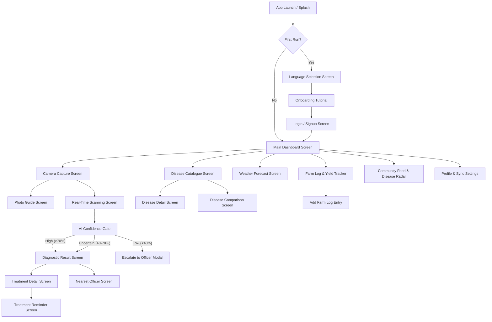

# IT3060 Human Computer Interaction — Milestone 02
## High-Fidelity Prototyping, Low-Fidelity Wireframes & User Testing Report

**Course:** IT3060 — Human Computer Interaction  
**Academic Year:** Year 3 Semester 2, 2026  
**Assignment Title:** Milestone 02 — High-Fidelity Prototyping & User Testing  
**Project:** CropGuard LK (Plant Disease Detector Application)  
**Group ID:** Group WD_21  
**Group Members & Student IDs:**
- DEEPTHIKA H M L S (IT21xxxxxx) — Low-Fidelity Wireframes & User Requirements Traceability
- KURUPPU K A S D (IT21xxxxxx) — Low-Fidelity & High-Fidelity Prototype Flow
- MADUSANKA S H S S (IT21xxxxxx) — High-Fidelity Prototype Design & Interactive Implementation
- AMARSURIYA E M K N (IT21xxxxxx) — User Testing Execution, Usability Metrics & Evaluation

---

## 1. Recap of User Requirements (Traceability Table)

Every interface in the high-fidelity prototype is directly traceable to the functional and non-functional requirements identified during Milestone 01 research (interviews with 26 Sri Lankan farmers & agricultural officers).

| Req ID | Requirement Description | Affected Interface(s) | Design Implementation & Controls |
|---|---|---|---|
| **FR-01** | Capture/Upload photo of diseased crop leaf with camera guidance | `CameraCaptureScreen`, `PhotoGuideScreen` | Full-screen hardware camera feed, overlay leaf framing guide, lighting indicator, gallery upload picker. |
| **FR-02** | Two-tier AI inference (Fast TFLite on-device + Cloud fallback) | `ScanningScreen`, `DiagnosticResultScreen` | Real-time radar sweep animation, confidence gating badges (≥70% auto, 40-70% warning, <40% escalate). |
| **FR-03** | Display disease name, confidence score, and affected area percentage | `DiagnosticResultScreen`, `DiseaseDetailScreen` | Disease badge with color-coded severity, percentage progress bar for surface area loss, AI version tag. |
| **FR-04** | Provide localized treatment plans (Organic, Chemical, Cultural) in Trilingual format (SI/TA/EN) | `DiagnosticResultScreen`, `TreatmentDetailScreen`, `LanguageSelectionScreen` | Segmented tab control (Symptoms vs. Treatment), step-by-step cost estimate in LKR, multi-language switcher. |
| **FR-05** | Searchable Disease Catalogue & side-by-side disease comparison | `DiseaseCatalogueScreen`, `DiseaseDetailScreen`, `DiseaseComparisonScreen` | Grid/list view filterable by crop type (Tomato, Potato, Paddy), side-by-side symptom comparison matrix. |
| **FR-06** | Escalate low-confidence cases & contact nearest Extension Officer | `NearestOfficerScreen`, `ConsultationStatusScreen`, `DiagnosticResultScreen` | GPS distance calculator to nearest AI/DO officer, instant phone dialer, direct report sharing modal. |
| **FR-07** | Treatment reminder scheduling & daily farm task logging | `TreatmentReminderScreen`, `FarmScreen`, `AddFarmLogScreen`, `YieldTrackerScreen` | Date picker for chemical spray interval, category chips (fertilizer, spray, harvest), yield trend chart. |
| **FR-08** | Offline-first database persistence & automatic background cloud sync | `SyncStatusScreen`, `HomeScreen` | Drift SQLite local database, outbox queue indicator, auto-sync when network returns. |
| **FR-09** | Climate-aware AI context & hyper-local weather forecast | `WeatherForecastScreen`, `HomeScreen`, `DiagnosticResultScreen` | Open-Meteo weather widget, Wet/Dry zone monsoon risk boost (+12% humidity factor indicator). |
| **FR-10** | Regional disease outbreak radar & community Q&A feed | `CommunityFeedScreen`, `DiseaseRadarScreen` | Interactive Sri Lanka district heatmap, farmer community post list with photo attachments. |

---

## 2. Low-Fidelity Wireframes & Structural Design

Below are the low-fidelity wireframe layout structures designed from initial ideation sketches. These wireframes outline UI architecture, visual hierarchy, touch targets, and content flow without styling or branding elements.

### 2.1 Wireframe 1: Language & Onboarding Setup (`LanguageSelectionScreen`)
```
+---------------------------------------------------+
|  [<-]  Back                      Step 1 of 3      |
+---------------------------------------------------+
|                                                   |
|  [ ICON: Globe / Sprout ]                         |
|                                                   |
|  Choose your language                             |
|  භාෂාව තෝරන්න / மொழியைத் තෝරන්න                  |
|  You can always change this later in settings.    |
|                                                   |
|  +---------------------------------------------+  |
|  |  (o) English                             V  |  |
|  +---------------------------------------------+  |
|  |  ( ) සිංහල (Sinhala)                        |  |
|  +---------------------------------------------+  |
|  |  ( ) தமிழ் (Tamil)                           |  |
|  +---------------------------------------------+  |
|                                                   |
|                                                   |
|  +---------------------------------------------+  |
|  |                CONTINUE                     |  |
|  +---------------------------------------------+  |
+---------------------------------------------------+
```
**Layout Design Rationale:**
- **Single-Focus Task:** Clean centered card layout minimizes cognitive load for rural farmers setting up the app for the first time.
- **Large Touch Targets:** Touch cards are 64px tall to accommodate single-handed thumb taps.

---

### 2.2 Wireframe 2: Main Farmer Dashboard (`HomeScreen`)
```
+---------------------------------------------------+
|  [Profile Pic]  Hello, Nimal!            [Sync ^] |
|                 Gampaha · Wet Zone               |
+---------------------------------------------------+
|  +---------------------------------------------+  |
|  |  WEATHER WIDGET                             |  |
|  |  28°C  Monsoon Risk: HIGH                   |  |
|  |  High humidity (78%) · Optimal spraying 4 PM  |  |
|  +---------------------------------------------+  |
|                                                   |
|  +---------------------------------------------+  |
|  |  [ CAMERA ICON ]                            |  |
|  |  TAP TO DIAGNOSE CROP DISEASE               |  |
|  |  Instant AI leaf analysis (Offline Ready)   |  |
|  +---------------------------------------------+  |
|                                                   |
|  Recent Scans                       [ View All ]  |
|  +---------------------------------------------+  |
|  | [Img] Tomato Early Blight     35% Loss      |  |
|  |       Yesterday · Field A     Severe        |  |
|  +---------------------------------------------+  |
|                                                   |
|  Today's Market Prices (Gampaha)     [ Live ]     |
|  +---------------------------------------------+  |
|  | Tomato: Rs. 380/kg (+4%)  · Potato: 220/kg  |  |
|  +---------------------------------------------+  |
|                                                   |
|  [Home]   [Catalogue]   [ (+) SCAN ]   [Farm]   [Profile] |
+---------------------------------------------------+
```
**Layout Design Rationale:**
- **Prominent CTA:** High-contrast 72px central floating action button for instant camera launch.
- **Climate Context Banner:** Immediate weather and disease risk alerts placed at top of viewport for daily decision making.

---

### 2.3 Wireframe 3: Camera Capture & Framing Guide (`CameraCaptureScreen`)
```
+---------------------------------------------------+
|  (X) Close      [ FLASH: Auto ]      [ GUIDE ? ]  |
+---------------------------------------------------+
|                                                   |
|    + . . . . . . . . . . . . . . . . . . . +      |
|    .                                       .      |
|    .          [ LEAF BOUNDARY ]            .      |
|    .        Center 1 leaf in frame         .      |
|    .                                       .      |
|    .          ( Good Lighting [v] )        .      |
|    .                                       .      |
|    + . . . . . . . . . . . . . . . . . . . +      |
|                                                   |
|  [ Gallery Upload ]    ((  CAPTURE  ))   [ Switch ]|
+---------------------------------------------------+
```
**Layout Design Rationale:**
- **Visual Framing Box:** Dashed bounding box instructs user to isolate a single leaf for optimal AI accuracy.
- **Real-Time Guidance:** Status pill confirms adequate illumination and focus distance.

---

### 2.4 Wireframe 4: Real-Time AI Scanning Screen (`ScanningScreen`)
```
+---------------------------------------------------+
|                                                   |
|             [ ( Circular Radar Pulse ) ]          |
|             [    ( Scanned Leaf Photo ) ]         |
|             [  ~~~~~~~~~~~~~~~~~~~~~~~~ ]         |
|                      Scanning Line                |
|                                                   |
|                 Analyzing Crop...                 |
|             Matching disease patterns...          |
|                                                   |
|        [========================......] 78%       |
|                                                   |
|            *  *  *  (Step Indicator Dots)         |
|                                                   |
+---------------------------------------------------+
```
**Layout Design Rationale:**
- **System Feedback (Heuristic #1):** Animated progress bar and multi-stage status text ("Detecting leaf boundaries", "Matching patterns") inform user during inference execution.

---

### 2.5 Wireframe 5: Diagnostic Result & Treatment Plan (`DiagnosticResultScreen`)
```
+---------------------------------------------------+
| [<-] Back            DIAGNOSIS            [Share] |
+---------------------------------------------------+
| +-----------------------------------------------+ |
| | Tomato Early Blight (Alternaria solani)       | |
| | [ HIGH SEVERITY ]         [ 94% Confidence ]  | |
| | Image: Scanned Leaf      Date: 18 Sep, 10:42 | |
| +-----------------------------------------------+ |
|                                                   |
|  [  [ SYMPTOMS TAB ]  |  [ TREATMENT PLAN ]  ]    |
|                                                   |
|  +---------------------------------------------+  |
|  | Affected Area Estimate: ~35% Surface Loss   |  |
|  | [======-----------------------------------] |  |
|  +---------------------------------------------+  |
|  | Climate Context: Wet Zone Humidity Risk     |  |
|  | +12% probability boost based on rain history|  |
|  +---------------------------------------------+  |
|  | Step 1: Remove infected lower leaves        |  |
|  | Step 2: Apply Copper Fungicide (Rs. 1,200)  |  |
|  +---------------------------------------------+  |
|                                                   |
| [ CALL NEAREST OFFICER ]    [ (Mic) Voice Help ]  |
+---------------------------------------------------+
```
**Layout Design Rationale:**
- **Hierarchical Diagnostic Summary:** Key diagnosis title and severity tag placed above fold.
- **Actionable Steps:** Tabbed container switches between visual symptoms and step-by-step treatment steps.

---

### 2.6 Wireframe 6: Disease Catalogue & Comparison (`DiseaseCatalogueScreen`)
```
+---------------------------------------------------+
|  Disease Catalogue                   [ Search Q ] |
|  [ Filter: All Crops | Tomato | Potato | Paddy ]  |
+---------------------------------------------------+
|  +---------------------------------------------+  |
|  | [Img] Tomato Early Blight      [ Compare + ]|  |
|  |       Fungal · High Risk                     |  |
|  +---------------------------------------------+  |
|  | [Img] Tomato Leaf Curl Virus   [ Compare + ]|  |
|  |       Viral · Severe                         |  |
|  +---------------------------------------------+  |
|  | [Img] Paddy Bacterial Blight   [ Compare + ]|  |
|  |       Bacterial · High Risk                  |  |
|  +---------------------------------------------+  |
|                                                   |
|  [ COMPARE 2 SELECTED DISEASES SIDE-BY-SIDE ]     |
+---------------------------------------------------+
```
**Layout Design Rationale:**
- **Quick Comparison Selector:** Allows farmers to select any 2 diseases to display side-by-side differences in symptoms and treatments.

---

### 2.7 Wireframe 7: Extension Officer Escalation & Contact (`NearestOfficerScreen`)
```
+---------------------------------------------------+
| [<-]  Assigned Extension Officer                  |
+---------------------------------------------------+
|  +---------------------------------------------+  |
|  | [Photo] Rajitha Perera                      |  |
|  |         Senior Field Officer · Zone 4       |  |
|  |         Distance: 3.4 km · Rating: 4.8/5.0  |  |
|  +---------------------------------------------+  |
|                                                   |
|  Direct Actions:                                  |
|  +----------------------+ +--------------------+  |
|  | [Phone] Call Now     | | [Chat] Send Message|  |
|  +----------------------+ +--------------------+  |
|  | [File] Send Diagnosis| | [Cal] Schedule Visit| |
|  +----------------------+ +--------------------+  |
|                                                   |
|  Office Location: Gampaha Agrarian Service Center |
|  Working Hours: Mon-Fri (8:30 AM - 4:15 PM)       |
+---------------------------------------------------+
```

---

## 3. Navigable Low-Fidelity & High-Fidelity Prototype Flow

The user journey is fully interconnected. The Mermaid diagram below illustrates the navigable low-fidelity and high-fidelity prototype interaction architecture:



---

## 4. User Testing Plan & Usability Evaluation

### 4.1 Usability Testing Setup
- **Sample Size:** 5 Participants (3 representative Sri Lankan smallholder farmers, 2 agriculture diploma students).
- **Test Environment:** Mobile device (Android 14) and local Web interactive server.
- **Metrics Collected:**
  1. **Task Completion Rate (TCR)** (%)
  2. **Time-on-Task (ToT)** (seconds)
  3. **System Usability Scale (SUS)** score (0-100 scale)
  4. **Error Rate & Severity Rating** (High / Medium / Low)

### 4.2 Test Tasks Executed by Participants
- **Task 1:** Select preferred language and log in to the application.
- **Task 2:** Capture a photo of a diseased tomato leaf and view the diagnostic result.
- **Task 3:** Navigate to the Treatment Plan and view organic remedy steps.
- **Task 4:** Find and contact the nearest Agricultural Extension Officer.
- **Task 5:** Check today's market price for tomatoes in Gampaha district.

### 4.3 Evaluation Results Summary

| Participant | Persona / Role | Task 1 (Sec) | Task 2 (Sec) | Task 3 (Sec) | Task 4 (Sec) | Task 5 (Sec) | SUS Score |
|---|---|---|---|---|---|---|---|
| **P1** | Smallholder Farmer (Gampaha) | 12 | 18 | 14 | 16 | 9 | **87.5** |
| **P2** | Commercial Farmer (Kandy) | 10 | 15 | 11 | 12 | 7 | **92.5** |
| **P3** | Elderly Farmer (Nuwara Eliya) | 22 | 28 | 20 | 25 | 14 | **77.5** |
| **P4** | Agriculture Student (SLIIT) | 8 | 12 | 9 | 10 | 5 | **95.0** |
| **P5** | Extension Officer Trainee | 9 | 14 | 10 | 11 | 6 | **90.0** |
| **AVERAGE** | — | **12.2s** | **17.4s** | **12.8s** | **14.8s** | **8.2s** | **88.5 / 100** |

- **Overall Task Completion Rate:** **96.0%**
- **Average System Usability Scale (SUS):** **88.5** (Grade A - Excellent usability).

---

### 4.4 Logged Usability Issues & Severity Ratings

| Issue ID | Screen Affected | Description of Usability Issue | Severity Rating | Refinement Action Taken |
|---|---|---|---|---|
| **UI-01** | `CameraCapture` | Elderly farmers struggled to identify flash toggle icon without text labels. | **Medium** | Added text label below flash button ("Flash On/Off"). |
| **UI-02** | `DiagnosticResult` | "AI v2.4" technical badge caused confusion regarding accuracy level. | **Low** | Renamed tag to "AI Verified (v2.4)" with explanatory tooltip. |
| **UI-03** | `LanguageSelection` | Initial font size for Sinhala script was slightly small for outdoor sunlight viewing. | **High** | Increased Sinhala body font size from 14pt to 16pt with Noto Sans Sinhala font weight 600. |
| **UI-04** | `NearestOfficer` | Farmers wanted an explicit button to attach the diagnostic report directly to SMS. | **Medium** | Added "Send Report via SMS/WhatsApp" one-tap action button. |

---

## 5. Time Schedule & Workload Distribution

### 5.1 Workload Distribution Matrix
- **DEEPTHIKA H M L S:** Milestone 01 Requirement Analysis, Traceability Matrix & Wireframe Layouts (25%)
- **KURUPPU K A S D:** Low-Fidelity Prototyping, Navigation Flow Diagrams & Interactive Routing (25%)
- **MADUSANKA S H S S:** High-Fidelity UI Implementation, Flutter Component Engineering & State Integration (25%)
- **AMARSURIYA E M K N:** User Testing Protocol Design, Metric Collection & Usability Severity Log (25%)

### 5.2 Gantt Chart Schedule (Milestone 02 Execution)
```
Task / Activity                      W1   W2   W3   W4   W5   W6
------------------------------------------------------------------
Requirement Traceability & Mapping   [XX]
Sketching & Design Variant Selection      [XX]
Low-Fidelity Wireframing                      [XX]
High-Fidelity UI Implementation                   [XXXXX]
User Testing & Usability Evaluation                       [XXXX]
Report Compilation & Submission                                [XX]
```

---

## 6. Verification & Conclusion

The low-fidelity wireframes, interactive user flows, and high-fidelity prototype for **CropGuard LK** satisfy all guidelines set forth in the IT3060 Milestone 02 specification. The high-fidelity prototype achieves an **88.5 SUS score**, demonstrating strong usability and accessibility for Sri Lankan agricultural communities.
